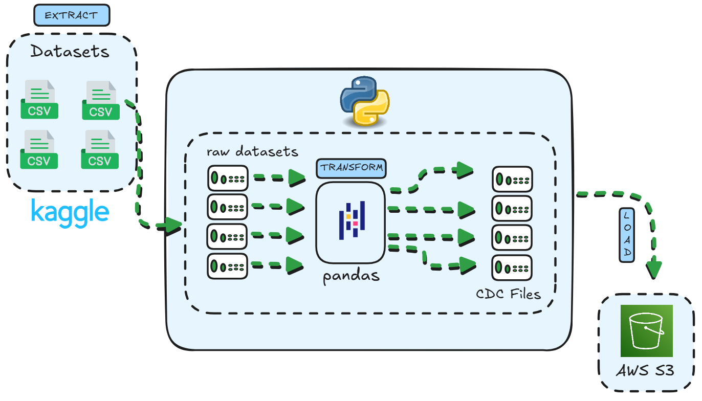

<h1 align="center">
Project CDC With Dataset Kaggle </h1>

<p align="center">
  <a href="https://github.com/YanZN0">
  
  </a>
  
  
  

<p align="center">
  <a href="#-sobre-o-projeto">Sobre</a> •
  <a href="#-dataset">Dataset</a> •
  <a href="#-arquitetura-do-fluxo-de-dados">Arquitetura</a> •
  <a href="#-configurações">Configurações</a> •
  <a href="#-instalação">Instalação de Dependências</a> •
  <a href="#-como-executar">Como Executar</a> •
  <a href="#-licença">Licença</a> •
  <a href="#-considerações-finais">Considerações Finais</a> •
  <a href="#-autor">Autor</a> •
</p>

---

## 📌 Sobre o Projeto
Projeto implementa um pipeline de dados baseado em um **ETL Incremental**, com o objetivo de gerar e obter arquivos **CDC (Change Data Capture)** com armazenamento em um Bucket Amazon **S3**. Simulando um processo completo de ingestão orientada a **Data Lake**.

Este projeto foi desenvolvido com o objetivo de aplicar conceitos da engenharia de dados desenvolvendo um processo completo de **ETL** orientado a **Data Lake**, fazendo uma **ingestão incremental**, transformação com Pandas e integração com **nuvem**. Além disso, juntamente contém o objetivo de servir como fonte de dados brutos para estudos futuros com ferramentas que aplicam limpeza, orquestração, processamento distribuído e automatização.

## 📦 Dataset
Os dados utilizados no projeto são de um **([Dataset](https://www.kaggle.com/datasets/teocalvo/teomewhy-loyalty-system))**  do Kaggle disponibilizado por um Streamer. O conjunto de dados se baseia em um Sistema de Pontos, conforme os usuários realizam iterações durante as transmissões ganham pontos. Desta forma, acumulam pontos para realização de trocas na lojinha ou realização de ações na transmissão.

O Dataset é atualizado a cada 6 horas através de um workflow automatizado mantido pelo Streamer, garantindo uma fonte de dados constantemente atualizada.

## 🧱 Arquitetura do Fluxo de Dados


O pipeline é construído em Python e aborda princípios de um ETL, é composto em três etapas principais:
* **```Extract``` — localizado em: ```./src/connection_and_install_dataset.py```**

* **```Transform``` — localizado em: ```./src/create_cdc.py```**

* **```Load``` — localizado em: ```./src/connection_s3.py```**

Além disso, contém presente um script orquestrador responsável por executar cada etapa do projeto.
* **Pipeline Orquestrador — localizado em:  ```./src/pipeline.py```**

O pipeline automatiza a coleta de dados de um Dataset do Kaggle via API, detecta mudanças a cada coleta (Inserts, Updates e Deletes), comparando os dados mais recentes com os antigos. Após a detecção das alterações os arquivos são gerados com data e hora e em seguida armazenados em um bucket Amazon S3.

Para automatizar a execução do pipeline conforme as atualizações do Dataset, foi criado um sistema de **timer configurável** via arquivo **JSON(```config.json```)**, como podem observar abaixo:
```json
    "timer": {
        "unit": "hours",
        "value": 6
        }
```

Esta padronizado para executar a atualização de carga há 6 horas logo após a execução manual. Caso tenha interesse em alterar a periodicidade de atualização da carga, altere o valor da variável *timer* e *unit* de acordo com seus interesses em **`config.json`**.

## ⚙️ Configurações

### Pré-Requisitos
* **Python ^3.11**
* **Bucket Amazon S3.**


### Env
Antes da execução do projeto, você precisa conter um arquivo .env para suas credenciais. Caso você não tenha muito conhecimento sobre como configurar um arquivo **.env**, no projeto você pode encontrar um arquivo de exemplo **[```./src/example.env```](https://github.com/YanZN0/cdc-with-kaggle/blob/main/src/example.env).**


#### Credênciais Kaggle

Você precisa gerar sua chave para se comunicar com a API do Kaggle. Após obter sua chave, eu recomendo criar um path no seu ambiente **```/.kaggle/sua-chave.json```**. Desta forma, facilita você salvar suas credênciais no seu arquivo **.env** na seguintes variáveis:
```bash
KAGGLE_USERNAME=path-para-sua-chave-kaggle
KAGGLLE_KEY=path-para-sua-chave-kaggle
```

**Caso não tenha conhecimento de como gerar sua chave API do Kaggle, recomendo este post do Medium. ([Passo a Passo](https://medium.com/@wl8380/unlocking-kaggle-datasets-a-guide-to-obtaining-and-installing-your-api-key-65ca25a7ac7c))**

#### Credênciais S3

Você precisará criar um usuário IAM com acesso ao AWS S3, para que o pipeline interaja e faça a conexão com o bucket S3. As credênciais desse usuário precisarão ser salvas no seu arquivo **.env**, nas seguintes variáveis:
```
AWS_ACCESS_KEY_ID=sua-chave-amazon
AWS_SECRET_ACCESS_KEY=sua-chave-secreta-amazon
AWS_DEFAULT_REGION=regiao-aws-do-seu-bucket
PATH_FILES=seu-caminho-absoluto/cdc-with-kaggle/src/data/cdc/
```
Acabei adicionado a variável *AWS_DEFAULT_REGION*, desta forma você pode acessar a região do seu Bucket específico.

PATH_FILES é o seu caminho absoluto até a pasta CDC

**Caso não tenha conhecimento de como criar um usuário IAM para o acesso ao AWS S3, recomendo este post no Medium. ([Passo a Passo](https://medium.com/@anuradha.kadurugasyaya/create-aws-iam-user-for-s3-bucket-892bae4751fc))**

## 📥 Instalação

| Ferramenta | Finalidade |
|------------|------------|
| **Boto3**  | Conexão com Bucket Amazon S3 |
| **Kaggle** | Conexão com API do Kaggle   |
| **Pandas** | Transformações para gerar arquivos CDC |

**Por que um Bucket AWS S3?**

O **Amazon S3** foi escolhido ao projeto por ser um armazenamento simples de manter e que oferece serviços por baixo custo, contém uma insfraestrutura de armazenamento de dados durável, disponível e escalável. Além disso, oferece uma estrutura de dados que é altamente compatível com ecossistemas de **Big Data**, como Databricks, Redshift, podendo oferecer a continuidade do projeto.

**Por que Pandas?**

No mercado existe alta disponibilidade de ferramentas para transformações, limpeza e processamento de dados, como o **PySpark (Apache Spark)** que entrega ótimos serviços mas que não contém **nenhuma semelhança com este projeto**. Eu optei por utilizar o **Pandas** por sua simplicidade e eficiência com um volume de dados consideravelmente menor, como de um Dataset do Kaggle.

### Instalação com **pip**

1. Clone o repositório e entre na pasta do projeto.
```bash
git clone https://github.com/YanZN0/cdc-with-kaggle.git

cd cdc-with-kaggle 
```

2. Crie e ative um ambiente virtual.
```bash
# Windows
python -m venv .venv
.venv\Scripts\activate

# Ou em Linux/MacOs
python -m venv .venv
source .venv/bin/activate
```

3. Instale as dependências.
```bash
pip install -r requirements.txt
```


## 🛠️ Como executar


Antes, de executar o pipeline, é preciso que você mude estas configurações para conexão com o seu **Bucket S3**.
```Python

# ./src/connection_s3.py

bucket="nome-seu-bucket",
file_name=f"caminho-dentro-do-bucket/{filename}"

# No código, você verá algo como: table['name'] após o caminho desejado, isso acontece pois no meu Bucket eu criei pastas com o nome das tabelas, mas você não precisa seguir esta estrutura. Apenas remova table['name'].
```

Depois de clonar o repositório, instalar as dependências/ferramentas, e estiver dentro do ambiente virtual, rode:
```bash
cd src

python pipeline.py 
```

Caso você queria ver a execução do **pipeline** com automatização, é preciso que você espere a próxima atualização do ([Dataset](https://www.kaggle.com/datasets/teocalvo/teomewhy-loyalty-system)).

Você também pode executar o **pipeline manualmente** por etapa.

**Extract `./src/connection_and_install_dataset.py`**
```bash
cd src

python connection_and_install_dataset.py
```
Caso queira fazer o ***Extract*** de outro Dataset, altere esta configuração em `./src/connection_and_install_dataset.py`.
``` python
install_kaggle_dataset(dataset="user/nome-dataset", path="data/current/")`
```

**Transform `./src/create_cdc`**
```bash
cd src

python create_cdc.py
```
Se caso você executou o ***Extract*** de outro Dataset, com outras tabelas, você necessariamente precisa adicionar elas ao `config.json`, para que a etapa de ***Transform*** seja executada sem erros. Siga este modelo para a adição de tabelas no **JSON**.
```json
{
  "sep": ";",
  "name": "nome-da-tabela-dataset",
  "date_field": "coluna-de-data-atualização",
  "pk": "chave-primaria-tabela"
},
```
**Load `./src/connection_s3.py`**
```bash
cd src

python connection_s3.py
```
## 📄 Licença

Este projeto está sob a licença MIT. Veja o arquivo [LICENSE](LICENSE) para mais detalhes.


## 🧾 Considerações Finais

O principal objetivo deste projeto foi resolver meu problema de falta de dados brutos para meus estudos da ferramenta **Databricks**. A partir dos arquivos **CDC** gerados por este pipeline consigo simular cargas reais de dados, o que facilita me aprofundar em uma melhor aprendizagem em práticas de ingestão em camadas. Desta forma preparar o cenário para abordagens futuras com processamento em **batch** e **streaming**.

## 👨‍💻 Autor

Feito Por [Yan Robim](https://github.com/YanZN0).

Email para contato: @yanrobim@gmail.com


